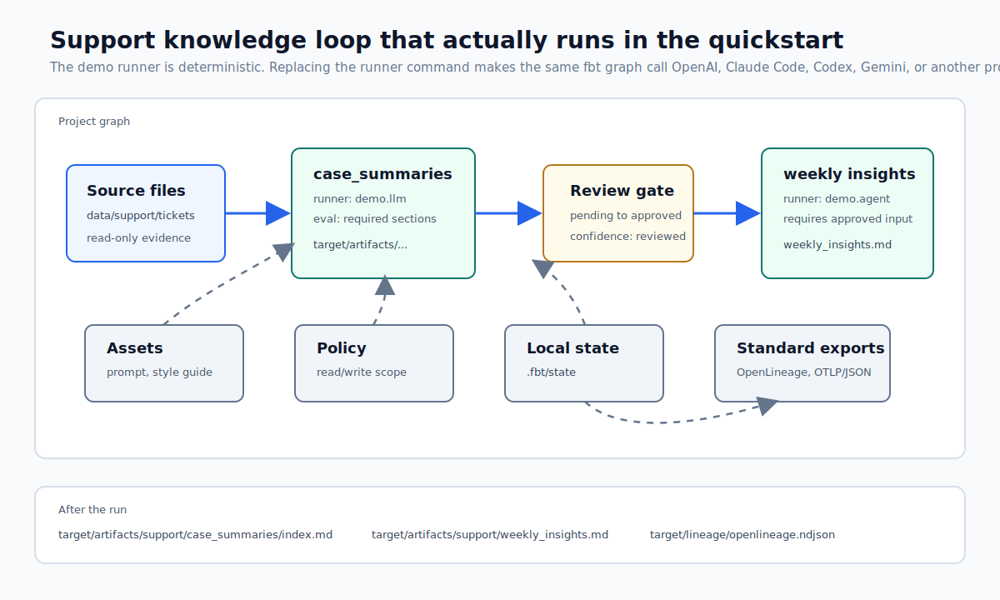

# fbt Usage Guide

Status: MVP-ready  
Created: 2026-05-28  
Audience: users defining and operating an `fbt` filesystem transformation project

## 1. Assumptions

This guide describes the implemented local MVP workflow. `fbt` core is a
control plane, not a transform engine. LLM calls, agent runtimes, document
converters, OCR, and SaaS connectors are provided by external runners or
plugins.

Base usage assumes:

- No daemon
- No scheduler
- No metadata database
- No cloud account
- Local filesystem state
- `fbt build` as the primary command

Runnable local loop from a source checkout:

```sh
fbt init knowledge_ops --template support
fbt parse --project-dir knowledge_ops
fbt doctor --project-dir knowledge_ops
fbt plan --project-dir knowledge_ops --select tag:support
fbt build --project-dir knowledge_ops --select case_summaries
fbt review approve case_summaries --project-dir knowledge_ops --comment "Reviewed locally"
fbt build --project-dir knowledge_ops --select weekly_support_insights
fbt docs generate --project-dir knowledge_ops
```

The support quickstart is intentionally small, but it exercises the implemented
control-plane loop:



Captured result from the same flow on 2026-05-28, with long hashes shortened:

```text
Plan: 2 selected, 1 run, 0 skipped, 1 blocked
run transform.knowledge_ops.case_summaries
  reason: no previous successful run
  reason: output missing
blocked transform.knowledge_ops.weekly_support_insights
  blocked: requires artifact.knowledge_ops.case_summaries current artifact
  next: fbt build --select case_summaries

Build: 1 selected, 1 run, 0 skipped, 0 blocked
success transform.knowledge_ops.case_summaries
  committed: artifact_version.knowledge_ops.case_summaries.sha256_a5b4...

artifact.knowledge_ops.case_summaries
  status: approved
  confidence: reviewed

success transform.knowledge_ops.weekly_support_insights
  committed: artifact_version.knowledge_ops.weekly_support_insights.sha256_49f...
```

Files created by the run:

```text
target/artifacts/support/case_summaries/index.md
target/artifacts/support/weekly_insights.md
target/docs/index.md
.fbt/state/run_results.jsonl
.fbt/state/artifact_versions.json
```

Standard exports from the same local state:

```sh
fbt export openlineage --output target/lineage/openlineage.ndjson
fbt export otel --output target/telemetry/otel.json
```

Expected export output:

```text
OpenLineage events written to target/lineage/openlineage.ndjson
Events: 2
OTel traces written to target/telemetry/otel.json
Spans: 4
```

## 2. Initialize a Project

```sh
fbt init knowledge_ops --template support
cd knowledge_ops
```

The MVP CLI implements `blank`, `support`, `knowledge_ops`, and `incident`
templates. The `support`, `knowledge_ops`, and `incident` templates include
deterministic demo runner wrappers so the build/review loop can run without
external services from a source checkout.

Generated layout:

```text
fs_project.yml
sources/
transforms/
prompts/
assets/
policies/
evals/
target/
.fbt/
```

Minimal `fs_project.yml`:

```yaml
name: knowledge_ops
config_version: 1
version: 0.1.0

source_paths: ["sources"]
transform_paths: ["transforms"]
asset_paths: ["prompts", "assets"]
policy_paths: ["policies"]
eval_paths: ["evals"]

target_path: "target"
artifact_path: "target/artifacts"

state:
  backend: local
  path: .fbt/state
```

## 3. Add Primary Documents

For the runnable support workflow, the template includes ticket JSONL data. A
larger support project may also add chat exports and call notes through extra
sources and runners.

```text
data/support/tickets/2026-05-28.jsonl
data/support/chats/thread-123.md
data/support/call_notes/call-456.docx
```

`sources/support.yml`:

```yaml
sources:
  - name: support
    artifacts:
      - name: raw_tickets
        type: jsonl_directory
        path: data/support/tickets/*.jsonl
        tests:
          - exists
          - min_file_count: 1

      - name: raw_chats
        type: markdown_directory
        path: data/support/chats/
        tests:
          - exists

      - name: raw_call_notes
        type: docx_directory
        path: data/support/call_notes/*.docx
        tests:
          - exists
```

Sources are read-only. Transforms must not mutate source files directly.

## 4. Add Transform Assets

LLM and agent transforms depend on prompts, style guides, rubrics, examples,
schemas, and scripts. These are `transform_asset` resources. The support
template keeps the runnable MVP small and uses a style guide plus deterministic
evals.

`prompts/case_summary.md`:

```markdown
# Role

You organize customer support knowledge.

# Task

Create reusable case summaries from tickets, chats, and call notes.

# Output Requirements

- Output Markdown
- Include citations to primary documents
- Separate facts from assumptions
- Include improvement actions for future cases
```

`assets/support_style_guide.md`:

```markdown
# Support Knowledge Style Guide

- Redact customer names and personal data unless required
- Separate cause, impact, response, and next improvement
- Avoid unsupported claims
- Prefer language that can be reused in FAQ content
```

`assets/assets.yml`:

```yaml
assets:
  - name: case_summary_prompt
    type: prompt
    path: prompts/case_summary.md

  - name: support_style_guide
    type: style_guide
    path: assets/support_style_guide.md
```

## 5. Define Policies and Evals

`policies/support.yml`:

```yaml
policies:
  - name: support_agent_scope
    read:
      - data/support/
      - target/artifacts/support/
    write:
      - .fbt/work/
      - target/artifacts/support/
    network: true
    tools:
      allow:
        - read_artifact
        - search_project
        - write_markdown
      deny:
        - write_source_files
        - shell
    limits:
      timeout_seconds: 600
      max_cost_usd: 3.00
      max_tool_calls: 40
    review:
      required: true
      group: support_leads
```

`evals/support.yml`:

```yaml
evals:
  - name: required_case_sections
    type: deterministic
    config:
      sections:
        - Summary
        - Customer Impact
        - Cause
        - Response
        - Next Improvement
    grants_confidence: structural

  - name: citation_coverage
    type: semantic
    runner: openai.responses
    config:
      min: 0.9
    grants_confidence: semantic

  - name: no_unsupported_claims
    type: llm_judge
    runner: openai.responses
    config:
      rubric: assets/no_unsupported_claims_rubric.md
      threshold: pass
    grants_confidence: semantic
```

MVP runs deterministic evals in core. Semantic, LLM-judge, and human-review
eval declarations are accepted as project metadata and recorded as skipped
unless an external eval runner is introduced.

## 6. Define Transforms

`transforms/support/case_summaries.yml`:

```yaml
transforms:
  - name: case_summaries
    type: llm
    runner: demo.llm
    model:
      provider: demo
      name: deterministic-demo-llm
    inputs:
      - source: support.raw_tickets
    outputs:
      - name: case_summaries
        type: markdown_directory
        path: target/artifacts/support/case_summaries/
    assets:
      - ref: case_summary_prompt
      - ref: support_style_guide
    policy: support_agent_scope
    evals:
      - required_case_sections
    review:
      required: true
      group: support_leads
    cache:
      mode: require_approval_for_reuse
    tags: ["support", "knowledge"]
```

`transforms/support/weekly_insights.yml`:

```yaml
transforms:
  - name: weekly_support_insights
    type: agent
    runner: demo.agent
    model:
      provider: demo
      name: deterministic-demo-agent
    inputs:
      - ref: case_summaries
        require:
          confidence: reviewed
          review:
            status: approved
    tools:
      - read_artifact
      - search_project
      - write_markdown
    outputs:
      - name: weekly_support_insights
        type: markdown
        path: target/artifacts/support/weekly_insights.md
    assets:
      - ref: support_style_guide
    policy: support_agent_scope
    evals:
      - required_agent_sections
    tags: ["support", "weekly"]
```

The downstream transform requires the current `case_summaries` artifact version to be reviewed and approved.

## 7. Replace Demo Runners

Generated runnable templates use demo runner names:

```yaml
runners:
  - name: demo.llm
    type: llm
    protocol: stdio_jsonrpc
    command: bin/fbt-demo-llm-runner

  - name: demo.agent
    type: agent
    protocol: stdio_jsonrpc
    command: bin/fbt-demo-agent-runner
```

These commands run deterministic protocol fixtures from the source checkout.
They prove the control-plane workflow, not provider quality.

To switch to real execution:

1. Install or write an external runner command.
2. Run `FBT_RUNNER_CONFORMANCE_COMMAND='your-runner' make runner-conformance`.
3. Add the runner to `fs_project.yml` with required `args`, `cwd`, and `env`
   names.
4. Change transform `runner:` values from `demo.*` to the external logical
   runner names.
5. Run `fbt doctor`, then `fbt plan` before building.

Adapter package conventions for OpenAI, Anthropic, Gemini, Codex CLI, Claude
Code, and similar integrations are in
[Runner Adapter Packaging](runner-adapters.md).

## 8. Parse

```sh
fbt parse
fbt doctor
```

Expected output:

```text
Parsed 11 resources
Manifest written to <project>/.fbt/state/manifest.json
```

Parse errors exit with code `2`. Diagnostics include a stable code, file and
line where available, and a `hint:` line for common YAML authoring mistakes
such as missing `config_version`, unresolved `ref:` values, unsupported
artifact types, or outputs outside `artifact_path`.

`fbt doctor` checks project parsing, state directory writability, state lock
acquisition, runner discovery, and runner protocol initialization. It exits
with code `6` when a runner or dependency readiness check fails.

## 9. Plan

```sh
fbt plan --select tag:support
```

Example output:

```text
Plan: 2 selected, 1 run, 0 skipped, 1 blocked

run transform.knowledge_ops.case_summaries
  reason: no previous successful run
  reason: output missing

blocked transform.knowledge_ops.weekly_support_insights
  blocked: requires artifact.knowledge_ops.case_summaries current artifact
  next: fbt build --select case_summaries
```

`fbt plan` explains both what will run and why something is blocked.

For a single artifact, use `artifact explain`:

```sh
fbt artifact explain weekly_support_insights
```

This shows the producing transform, inputs, current version if present,
previous run evidence, blocked or dirty reasons, and the same `next:` commands
shown in the plan.

To locate generated output and immutable stored content:

```sh
fbt artifact path case_summaries
fbt artifact show case_summaries
fbt artifact history case_summaries
```

## 10. Build

```sh
fbt build --select case_summaries
```

Example output:

```text
Build: 1 selected, 1 run, 0 skipped, 0 blocked
success transform.knowledge_ops.case_summaries
  committed: artifact_version.knowledge_ops.case_summaries.sha256_abcd
```

State files updated:

```text
.fbt/state/manifest.json
.fbt/state/state.json
.fbt/state/run_results.jsonl
.fbt/state/artifact_versions.json
.fbt/state/evaluation_results.json
.fbt/state/policy_decisions.json
```

## 11. Review

```sh
fbt review status case_summaries
fbt review show case_summaries
```

Example output:

```text
artifact.knowledge_ops.case_summaries
  version: artifact_version.knowledge_ops.case_summaries.sha256_abcd
  status: pending
  confidence: structural
  group: support_leads
  next: fbt review show case_summaries
```

`fbt review show case_summaries` displays the selected artifact version,
logical and immutable storage paths, digest, runner/model metadata, generating
run, and inspection commands to use before approval.

Approve the current version:

```sh
fbt review approve case_summaries --comment "Citations and customer impact reviewed"
```

Approval is bound to the current `artifact_version`, not just the logical path.

## 12. Build Downstream Artifacts

```sh
fbt build --select weekly_support_insights
```

Because `case_summaries` is approved, downstream transforms that require reviewed inputs can now run.

## 13. Inspect Diffs

After new source files arrive:

```sh
fbt plan --select tag:support
fbt diff case_summaries --against last-approved
```

This makes AI-generated document changes reviewable.

## 14. Generate Docs

```sh
fbt docs generate
```

Generated docs go to:

```text
target/docs/
```

Docs show:

- Transform outputs, runner, model, tools, and eval dependencies
- Current artifact pointers with path, confidence, and approval state
- Artifact versions
- Eval results
- Review approvals
- Policy decisions

Export artifact lineage when you want to inspect it in OpenLineage-compatible
tools:

```sh
fbt export openlineage --output target/lineage/openlineage.ndjson
```

The OpenLineage export keeps fbt-native state as the source of truth. It emits
transform runs, input and output datasets, and fbt-specific `fbt_` facets for
artifact descriptors, confidence, approvals, evals, runner/model, and policy
metadata without exporting raw artifact content or prompts. For OpenMetadata,
feed this OpenLineage output through OpenMetadata's external ingestion path;
fbt core does not provide a direct OpenMetadata export command.

Export execution telemetry when you want traces in an OpenTelemetry-compatible
backend:

```sh
fbt export otel --output target/telemetry/otel.json
```

The OTel export emits an OTLP/JSON trace payload. Build invocations and
transform runs become spans, runner events become span events, and usage/cost
plus model metadata becomes span attributes. fbt does not start a network
exporter by default; feed the JSON file to your collector/backend workflow.
For backend-specific steps, see
[Standard Visualization Guide](standard-visualization-guide.md).

## 15. Opt-In Real LLM Smoke

The default verification gate uses local deterministic runners. To smoke-test an
external real LLM runner that implements the fbt stdio JSON-RPC runner protocol:

```sh
FBT_REAL_LLM_RUNNER_COMMAND='fbt-openai-runner' make real-llm-smoke
```

Optional environment variables:

| Variable | Meaning |
|---|---|
| `FBT_REAL_LLM_RUNNER_COMMAND` | External command to execute; required to opt in |
| `FBT_REAL_LLM_RUNNER_NAME` | Runner name in the temporary project; defaults to `real.llm` |
| `FBT_REAL_LLM_MODEL_PROVIDER` | Model provider metadata; defaults to `external` |
| `FBT_REAL_LLM_MODEL_NAME` | Model name metadata; defaults to `real-llm-smoke` |

Provider credentials, endpoints, and SDK dependencies belong to the external
runner and its environment. If `FBT_REAL_LLM_RUNNER_COMMAND` is unset, the smoke
prints `skipped` and exits successfully.

## 16. Use External CLI Agents Safely

External coding-agent CLIs can be used behind an fbt runner adapter. Do not set
`runner.command` directly to an arbitrary interactive agent command unless that
command speaks the fbt stdio JSON-RPC protocol.

The recommended shape is:

```text
fbt build
  -> fbt protocol adapter command
  -> Codex CLI, Claude Code, Gemini CLI, or another agent runtime
  -> staged files
  -> fbt output candidates under work.outputs
```

Adapter commands should:

- run the external agent in a staging workspace or scoped copy
- translate fbt policy into the agent's permission, sandbox, network, tool, and
  timeout controls where supported
- fail closed when policy cannot be enforced safely
- copy final files into `work.outputs`
- emit redacted fbt events and output candidates

Core still owns the official commit. It validates negotiated capabilities,
rejects output candidates outside `work.outputs`, computes descriptors, records
state, and updates logical artifact paths only after policy/eval/review checks.

This is intentionally runner-agnostic. Codex CLI and Claude Code both expose
local command-line automation modes, but fbt does not depend on their packages
or provider SDKs. Install and configure those tools outside fbt core, then wrap
them with an adapter that implements the runner protocol.

Before using a custom runner in a project, run the protocol fixture:

```sh
FBT_RUNNER_CONFORMANCE_COMMAND='my-fbt-runner --flag value' make runner-conformance
```

## 17. Day-2 Operation

The operating loop:

```text
1. Add primary documents
2. Run fbt plan
3. Run fbt build
4. Inspect diffs
5. Run evals
6. Approve or reject artifact versions
7. Build downstream artifacts
8. Use generated knowledge artifacts in the next workflow
```

The purpose is to turn messy primary documents into reusable, reviewed knowledge artifacts that continuously improve operational work.

## 18. What fbt Does Not Do

`fbt` core does not implement:

- Ticket system sync
- Slack or email connectors
- Word / PDF / Excel parsing
- LLM provider APIs
- Agent runtimes
- Domain-specific business judgment

These belong in runners, connectors, plugins, or existing business systems.
